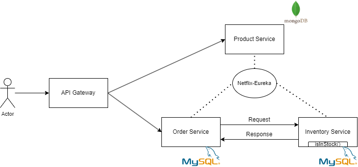

# microservices-new
Microservices Spring Boot App.

## Endpoints (plus means it exists, minus it does not)
|endpoint-name|GET|POST|DELETE|
|-|-|-|-|
|/api/order|-|+|-|
|/api/product|+|+|-|
|/api/inventory?skuCode={item}|+|-|-|
